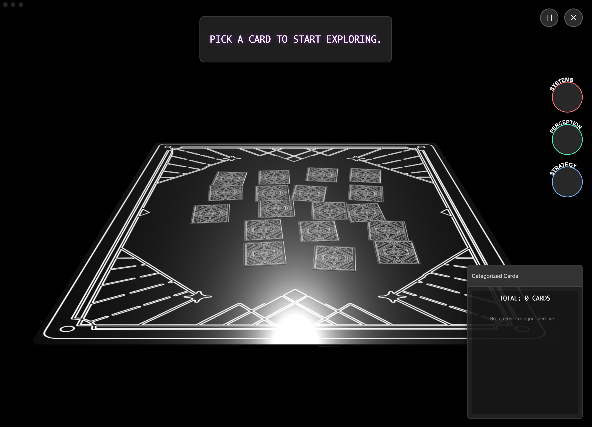

  
  
  <h1 align="center">MINIGAME 888</h1>
  <h3 align="center"> Cinematic 3D Card Showcasing and Categorization Experience </h3>

  <!-- TOP PURPLE LINKS -->
  
  
  
   
  <!-- BOTTOM GOLD TAXONOMY -->
  
  
  
  

  
<i>An elegant and immersive component designed to showcase a single Enigma in a stylized, animated 3D view.</i>

---

## Introduction

Welcome to **MiniGame 888**. This component integrates a live-rendered Babylon.js scene with dynamically animated text and draggable interfaces to create a focused, high-impact presentation of card-based assets.

---

## Quick Start

To start using MiniGame 888 today:
1. **Download the Repository**: Clone or download this repository directly into any folder inside your Obsidian vault.
2. **Install Datacore**: Ensure you have the **Datacore** plugin installed and enabled in Obsidian.
3. **Open the Entry Note**: Open the **`MINIGAME 888.md`** note inside Obsidian to launch the component!

---

## Features

### Runtime and Agentic Safety
*   **Interactive 3D Board**: Renders 3D card meshes inside a transparent BabylonJS viewport adapting seamlessly to host-native Obsidian themes.
*   **Cinematic Zoom and Orbit**: Interactive camera paths and cinematic introductory animations centering selected mesh cards.
*   **Watchdog Hot Reload**: File-based command watcher monitors `data/mcp_commands.json` for live component reloads without reopening the leaf.

### Security and Integrations
*   **Draggable PiPs (Picture-in-Picture)**: Floating windows that can be moved, minimized, or drag-targeted to classify cards under categorical lists.
*   **Local Asset Caching**: Dynamically downloads remote GLB models on demand and caches them locally under the component's `data/cache` folder.
*   **Zero-Dependency Core**: Scripts are loaded dynamically at runtime, ensuring no npm package overhead.

### User Interface and Developer Loop
*   **Hacker-Style Text Reveal**: Letter-by-letter reveal animation in `EnigmaViewer` for cinematic card inspections.
*   **Categorization Board**: Draggable cards can be dropped into named category pip windows, saved across sessions.
*   **Loading Confirmation Gate**: Tracks initial download status of asset bundles with per-asset progress feedback.

---

## Directory Index and Components

The package exposes the following files:

| File | Description |
| :--- | :--- |
| **[MINIGAME 888.md](MINIGAME%20888.md)** | Main entry point leaf designed to mount the component in Obsidian. |
| **[_RESOURCES/DATACORE/_DONE/MiniGame888/src/index.jsx](_RESOURCES/DATACORE/_DONE/MiniGame888/src/index.jsx)** | Entry coordinator connecting Datacore JSX blocks to the App root. |
| **[src/App.jsx](src/App.jsx)** | Main coordinator driving Babylon.js rendering, pointer observables, and Preact layout. |
| **[src/components/EnigmaViewer.jsx](src/components/EnigmaViewer.jsx)** | Dedicated 3D Babylon viewer for inspecting card details with letter-by-letter hacker-style reveal. |
| **[src/components/LoadingConfirmation.jsx](src/components/LoadingConfirmation.jsx)** | Confirms and tracks initial asset bundle downloads. |
| **[src/components/FreshPip.jsx](src/components/FreshPip.jsx)** | Universal window manager containing full dragging and minimization layout logic. |
| **[src/components/LoadingLogo.jsx](src/components/LoadingLogo.jsx)** | Animated BETO logo displayed during initial load states. |
| **[src/utils/LoadScriptUpgrade.js](src/utils/LoadScriptUpgrade.js)** | Offline caching script loader. |
| **[METADATA.md](METADATA.md)** | Packaging manifest outlining complexity, category, and dependencies. |
| **[CONTRIBUTION.md](CONTRIBUTION.md)** | Guidelines on zero ESM exports and modular layout. |
| **[LICENSE.md](LICENSE.md)** | MIT permissive distribution license. |

---

## Previews

|             Static View              |            Interactive Walkthrough            |
| :----------------------------------: | :-------------------------------------------: |
|  |  |

---

## Contributors
- beto.group
