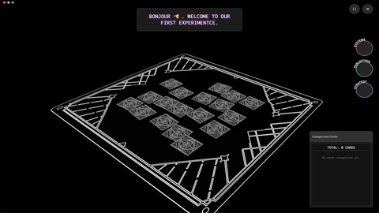

  
  
  <h1 align="center">MINIGAME 888</h1>
  <h3 align="center"> Cinematic 3D Card Showcasing & Categorization Experience </h3>

  <!-- TOP PURPLE LINKS -->
  
  
  
   
  <!-- BOTTOM GOLD TAXONOMY -->
  
  
  
  

  

    <i> An elegant and immersive component designed to showcase a single "Enigma" in a stylized, animated 3D view. </i>
  

  

Welcome to **Minigame 888**. This component integrates a live-rendered Babylon.js scene with dynamically animated text and draggable interfaces to create a focused, high-impact presentation of card-based assets.

---

## ✨ Features

*   🎮 **Interactive 3D Board**: Renders 3D card meshes inside a transparent BabylonJS viewport adapting seamlessly to host-native Obsidian themes.
*   💫 **Cinematic Zoom & Orbit**: Interactive camera paths and cinematic introductory animations centering selected mesh cards.
*   🏷️ **Draggable PiPs (Picture-in-Picture)**: Floating windows that can be moved, minimized, or drag-targeted to classify cards under categorical lists.
*   💾 **Local Asset Caching**: Dynamically downloads remote GLB models on demand and caches them locally under the component's `data/cache` folder.

---

## 📦 Directory Index & Components

The package exposes the following files:

| File | Description |
| :--- | :--- |
| **[MINIGAME 888.md](MINIGAME%20888.md)** | Main entry point leaf designed to mount the component in Obsidian. |
| **[src/index.jsx](src/index.jsx)** | Entry coordinator connecting Datacore JSX blocks to the App root. |
| **[src/App.jsx](src/App.jsx)** | Main coordinator driving Babylon.js rendering, pointer observables, and Preact layout. |
| **[src/components/EnigmaViewer.jsx](src/components/EnigmaViewer.jsx)** | Dedicated 3D Babylon viewer for inspecting card details with letter-by-letter hacker-style reveal. |
| **[src/components/LoadingConfirmation.jsx](src/components/LoadingConfirmation.jsx)** | Confirms and tracks initial asset bundle downloads. |
| **[src/components/FreshPip.jsx](src/components/FreshPip.jsx)** | Universal window manager containing full dragging and minimization layout logic. |
| **[src/utils/LoadScriptUpgrade.js](src/utils/LoadScriptUpgrade.js)** | Offline caching script loader. |
| **[METADATA.md](METADATA.md)** | Packaging manifest outlining complexity, category, and dependencies. |
| **[CONTRIBUTION.md](CONTRIBUTION.md)** | Guidelines on zero ESM exports and modular layout. |
| **[LICENSE.md](LICENSE.md)** | License specifications. |
